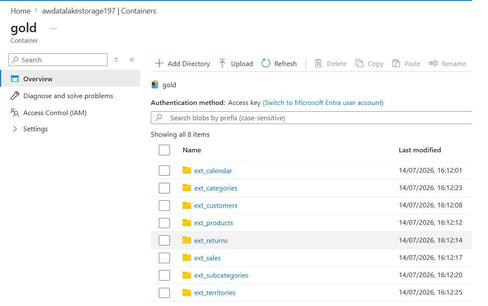
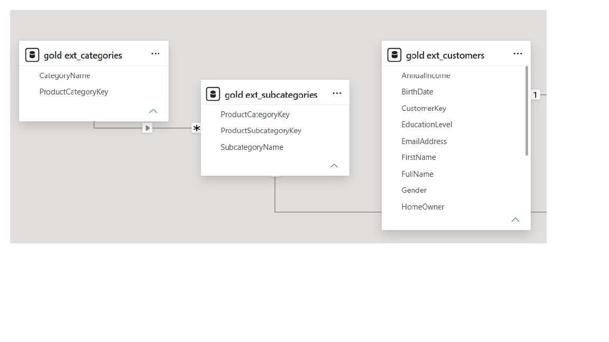
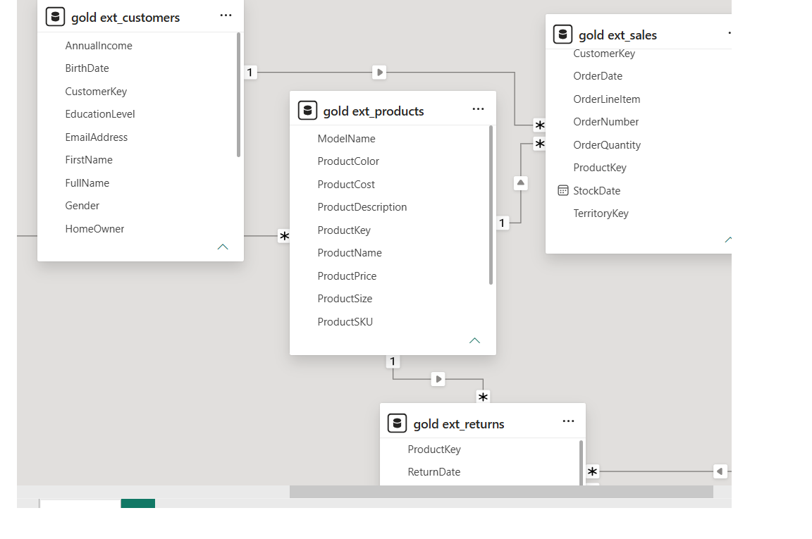
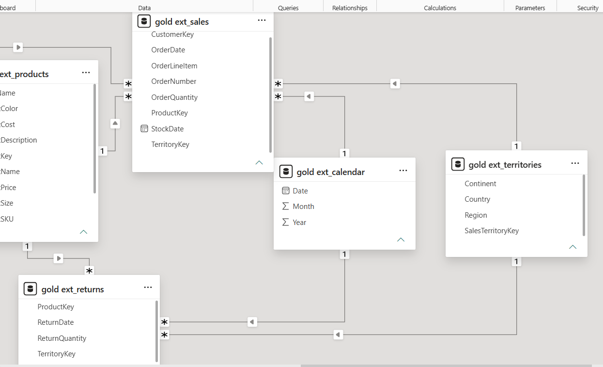

🚀 Azure End-to-End Data Engineering Pipeline

📖 Project Overview

This project demonstrates a complete, end-to-end Data Engineering pipeline using the Microsoft Azure ecosystem. It ingests raw sales and customer data, processes it through a Medallion Architecture (Bronze, Silver, Gold), and serves it for business intelligence reporting.

🏗️ Architecture & Technologies Used

Data Orchestration: Azure Data Factory (ADF)

Data Storage: Azure Data Lake Storage Gen2 (ADLS)

Data Transformation: Azure Databricks (PySpark) & Unity Catalog

Data Serving / Data Warehouse: Azure Synapse Analytics (Serverless SQL)

Business Intelligence: Power BI

⚙️ Pipeline Workflow

1. Data Ingestion (Bronze Layer)

Orchestrated data pipelines using Azure Data Factory to ingest raw transactional data from an HTTP REST API/GitHub source.

Landed raw, untransformed data into the Bronze container in Azure Data Lake Gen2 for historical archiving.

2. Data Transformation (Silver Layer)

Utilized Azure Databricks and wrote PySpark notebooks to mount storage securely using Azure Managed Identities (Access Connectors).

Performed data cleaning, schema enforcement, dropped null values, and transformed data types.

Wrote the clean, tabular data back to the Silver container in Parquet format.

3. Data Serving & Aggregation (Gold Layer)

Leveraged Azure Synapse Analytics (Serverless SQL pools) to query the Silver Data Lake directly using OPENROWSET.

Designed and executed CETAS (Create External Table As Select) statements to generate highly optimized, pre-aggregated Fact and Dimension tables.

Pushed final business-ready tables to the Gold container.

4. Data Modeling & Reporting

Connected Power BI to the Synapse Serverless SQL endpoint using Import mode.

Designed a Star Schema data model (1 Fact table to Many Dimension tables) for optimized query performance.

## 📸 Screenshots

